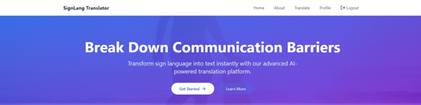

# **Sign Language Recognition for Deaf and Dumb**

- This sign language recognition project involved creating a custom dataset, preprocessing images, training a model, integrating with React, and hosting with Firebase. 

- The result is a real-time sign language recognition application that recognizes a variety of sign language gestures.

- Our Model is trained for 26 alphabets and 16 words of ASL and which are commonly used in general communication.

## Features

- Real-Time Recognition

- Easy-to-Use Interface

- Adaptive Learning

- High Accuracy

- Real Time User Progress Data

## Tech Stack

**Front-end:**

- React
- Redux
- Tailwind

**Back-end:**

- NodeJS
- SQLite

**Machine Learning Framework:**

- MediaPipe

**NPM Packages:**

- @mediapipe/drawing_utils
- @mediapipe/hands
- @mediapipe/tasks-vision
- @redux-devtools/extension
- @reduxjs/toolkit
- framer-motion
- lucide-react
- react-dom
- react-redux
- react-router-dom
- react-webcam
- tailwind-css
- redux
- axios
- redux-thunk
- uuid

## Project Details

- **Research Documentation:** [View .docx](./Documentation%20of%20Research%20Project.docx)

- **Research Paper:** [View .docx](#)

- **Dataset Link:** [Sign_Dataset](https://drive.google.com/drive/folders/1LUUknqqRNHAmIZYrcgo-4n2HrM37uFa3?usp=share_link)

- **Gesture Recogition Documentation:** [Mediapipe](https://developers.google.com/mediapipe/solutions/vision/gesture_recognizer)

- **A Copy of Trained Model is located in root folder**

## Steps to set up the project

- Clone this git repository
- Open terminal, type `cd backend` then `npm install` followed by `npm run start`
- Now open another terminal, type `cd project` then `npm install` followed by `npm run dev`
- Wait for the react development server to start, if not opened automatically, manually visit `localhost:5173`

## Acknowledgements

- [React](https://react.dev/)
- [mediapipe](https://developers.google.com/mediapipe)
- [NPM](https://www.npmjs.com/)

## Screenshots

# 🤝 Contributing
  * Fork the repo and create a feature branch.
  * Write clean, modular, well-commented code.
  * Submit a pull request with a clear description.

# 📄 License
This project is licensed under the GPL 3.0 License.
